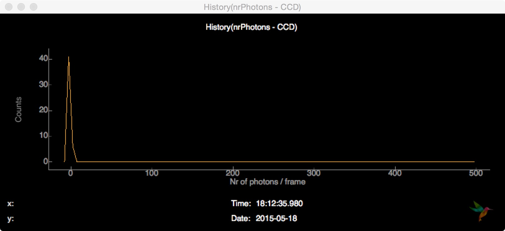
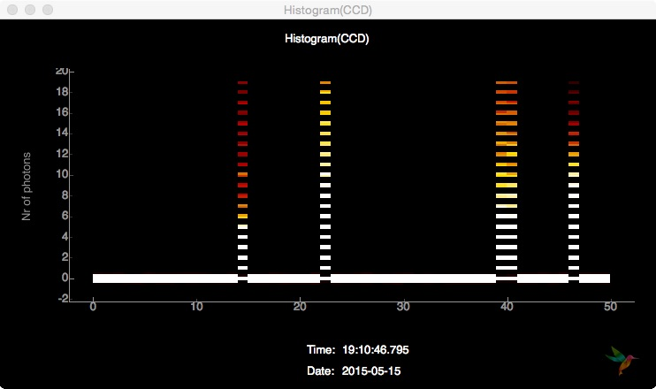
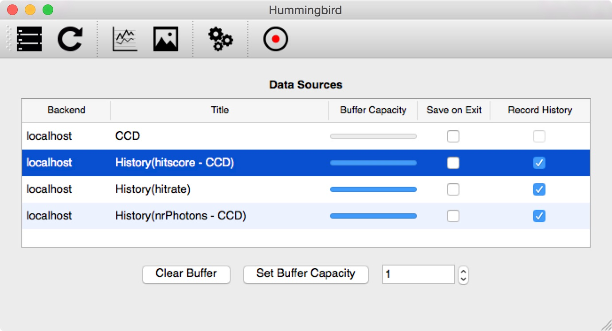
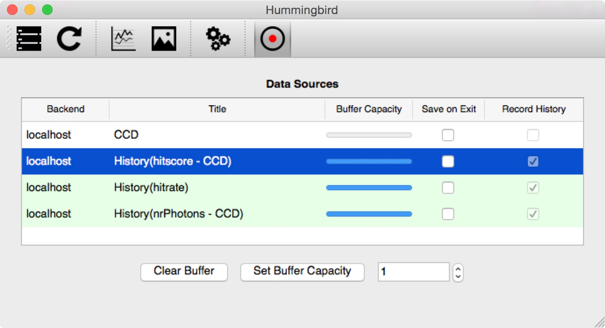
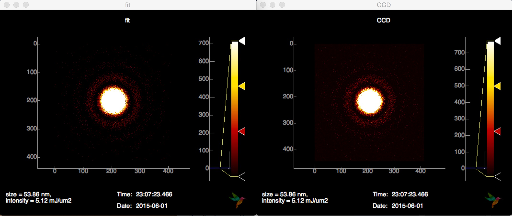

Advanced examples
=================

Simulation
----------
For most of the following examples, simulated data provided through `Condor <http://lmb.icm.uu.se/condor/simulation>`_ is used. In order to run these examples on real data, the only thing to change is the ``state[Facility]`` variable and maybe some more lightsource specific configurations. See the basic example in `Configuration <configuration.html>`_.

The speciman used for the simulation is a icosahedron-shaped virus with a diameter of 60 nm with reasonable conditions for experiments inside the 100nm chamber of the CXI beamline. The full Condor configuration file is located in ``examples/simulation/virus.conf``.

Now, lets have a look at the configuration file, located in ``examples/simulation/conf.py``. First, the modules ``simulation`` and ``analysis.event`` are imported:

::

   import simulation.simple
   import analysis.event

The `Condor <http://lmb.icm.uu.se/condor/simulation>`_ configuration file is loaded and a hitrate of 10% is specified:

::

   sim = simulation.simple.Simulation("examples/simulation/virus.conf")
   sim.hitrate = 0.1

In the ``state`` variable, it is necessary to provide the simulation ``sim`` and specify the datasets to be extracted:

::

   state = {
       'Facility': 'Dummy',

       'Dummy': {
           'Repetition Rate' : 1,
           'Simulation': sim,
           'Data Sources': {
	       'CCD': {
	           'data': sim.get_pattern,
		   'unit': 'ph',
		   'type': 'photonPixelDetectors'
	       },
               'pulseEnergy': {
	           'data': sim.get_pulse_energy,
                   'unit': 'J',
                   'type': 'pulseEnergies'
	       },
               'inj_x': {
                   'data': sim.get_position_x,
                   'unit': 'm',
                   'type': 'parameters'
		               },
	       'inj_y': {
	           'data': sim.get_position_y,
                   'unit': 'm',
                   'type': 'parameters'
	       },
               'inj_z': {
                   'data': sim.get_position_z,
                    'unit': 'm',
                    'type': 'parameters'
	       }
           }        
       }
   }

Inside the ``onEvent`` function it is possible to apply analsyis algorithms to the simulated datasets and send plots to the frontend, for now some extracted information is printed:

::

   def onEvent(evt):
       analysis.event.printProcessingRate()
       analysis.event.printKeys(evt)
       analysis.event.printKeys(evt, "parameters")

Here is the output of this small simulation example:

::

   $ ./hummingbird.py -b examples/simulation/conf.py
   Starting backend...
   1/1 (1 particle)
   The event has the following keys:  ['pulseEnergies', 'photonPixelDetectors', 'parameters']
   The event dict ''parameters'' has the following keys:  ['inj_y', 'inj_x', 'inj_z']
   1/1 (1 particle)
   Processing Rate 0.86 Hz
   The event has the following keys:  ['pulseEnergies', 'photonPixelDetectors', 'parameters']
   The event dict ''parameters'' has the following keys:  ['inj_y', 'inj_x', 'inj_z']

Detector characteristics
------------------------
In this example it is shown how detector-specific characteristics (histograms, averages, ... ) can be visualized. This is very important for a robust tuning of more advanced analysis (hitfinding, sizing, ...). The configuration file ``examples/detector/conf.py`` is based on the simulation example, but some more modulues need to be imported:

::

   import simulation.simple
   import analysis.event
   import analysis.pixel_detector
   import plotting.line
   import plotting.image
   
In the ``onEvent`` some more lines are added. First, some detector statistics are printed

::

   # Detector statistics
   analysis.pixel_detector.printStatistics(evt["photonPixelDetectors"])

giving the following output:

::

   $ ./hummingbird -b examples/detector/conf.py
   Processing Rate 0.65 Hz
   CCD (count): sum=-79.434 mean=-0.000463453 min=-0.412553 max=0.506501 std=0.100154
   1/1 (1 particle)
   Processing Rate 0.65 Hz
   CCD (count): sum=-46.7338 mean=-0.000272666 min=-0.456227 max=0.47392 std=0.100047
   1/1 (1 particle)

Then, the total nr. of photons is counted on the CCD pixel detector and the result is being sent to the frontend, so that it is possible to follow the history of the total photon count.

::
   
   # Count Nr. of Photons
   analysis.pixel_detector.totalNrPhotons(evt, "photonPixelDetectors", "CCD")
   plotting.line.plotHistory(evt["analysis"]["nrPhotons - CCD"], label='Nr of photons / frame', history=50)

On the frontend, this history can be displayed by opening a Line plot and subscribing to the data source ``History(nrPhotons - CCD)``:

.. image:: images/examples/detector/nrphotons.jpg

Inside the ``View`` -> ``Plot settings`` dialog there is an option to display a histogram of the current buffer instead of the updating history:

	   
The next useful detector feature to look is a frame histogram of the entrie CCD:

::
   
   # Detector histogram
   plotting.line.plotHistogram(evt["photonPixelDetectors"]["CCD"], **histogramCCD)

The parameters for the histogram plot (as for any other plot) can be given as keyword arguments or defined outside the ``onEvent`` function as a dictionary which is then passed as a whole to the plotting function:

::

   histogramCCD = {
       'hmin': -1,
       'hmax': 19,
       'bins': 100,
       'label': "Nr of photons",
       'history': 50}

   def onEvent(evt):

       ...
       plotting.line.plotHistory(..., history=50)
       plotting.line.plotHistogram(..., **histogramCCD)

Subscribing to the detector histogram ``Hist(CCD)`` in a Line plot, the visual output looks like this:

.. image:: images/examples/detector/histogram_hit.jpg
   :align: center

Subscribing to the same data source in an Image Plot, the output is a history of histograms looking like this:

	   
Finally, it is possible to just send every detector frame (or a subset of it based on e.g. hitfinding) as an image

::
   
    # Detector images
    plotting.image.plotImage(evt["photonPixelDetectors"]["CCD"])

and display it on the frontend. Instead displaying only the latest image, it is possible to toggle the visualization of the trend (mean, min, max, std) inside the ``View`` -> ``Plot settings`` dialog:

.. image:: images/examples/detector/buffer.jpg
   :align: center

The latest image of the buffer (50 images) is displayed on the left, the per-pixel maximum of the buffer in the middle and the per-pixel mean on the right.	   
	   

Hitfinding
----------
In this example, a simple hitfinder is introduced. This makes it possible to monitor the hit rate and plot only detector images of hits. This configuration file ``examples/hitfinding/conf.py`` is based on the previous on, in addition the hitfinding module needs to be imported:

::

   import analysis.hitfinding

The hitfinder used here simply counts the number of lit pixels on the detector, it needs a threshold to stay above the ADU noise level and another threshold that is above the hitscore of the background. In order to tune this parameters, it helps to plot the hitscore and look at the histogram (see plotting below). Based on the given hit/miss counts, a hit rate is estimated. The ``history`` parameter determines how many events are considered for the calculation of the rate.
   
::

   # Simple hitfinding (Count Nr. of lit pixels)
   analysis.hitfinding.countLitPixels(evt, "photonPixelDetectors", "CCD", aduThreshold=0.5, hitscoreThreshold=10)
  
   # Compute the hitrate
   analysis.hitfinding.hitrate(evt, evt["analysis"]["isHit - CCD"], history=100)

Like in the previous examples, results are plotted as history plots and images. Because of the hitfinding, the detector image needs to be only plotted for hits. Looking at the previous example, it is possible to look at trends (mean, std, min, max) of either hits, misses or both.
    
::

   # Plot the hitscore
   plotting.line.plotHistory(evt["analysis"]["hitscore - CCD"], label='Nr. of lit pixels')

   # Plot the hitrate
   plotting.line.plotHistory(evt["analysis"]["hitrate"], label='Hit rate [%]')
     
   # Plot hit images
   if evt["analysis"]["isHit - CCD"]:
       plotting.image.plotImage(evt["photonPixelDetectors"]["CCD"])

When looking at the hit images, it is possible to jump back and forth in time using the arrow keys. This way, interesting hits can revisited if they passed by too quickly. Jumping all the way to the hight (most recent hit), enables live updating again.

MPI
---
In order to speed up things, it is possible to run ``Hummingbird`` in MPI mode, simply use:

::

   $ mpirun -n 4 ./hummingbird.py -b examples/hitfinding/conf.py

In this mode, ``Hummingbird`` reserves one process (rank 0) for sending data to the frontend, the rest of the processes (slaves with rank > 1) are used to process incoming data. If necessary (e.g. for hitrate), the  main slave (rank = 1) is doing the reduction and sending the reduced data to the frontend.

In the above example, the slaves are still reading all from the same data source (e.g. shared memory string defined in ``state['Facility/DataSource']``). If there are multiple data sources available (e.g. multiple shared memory streams defined by individual shared memory strings), it is possible to distribute slaves across these data sources. The configuration file needs to be slightly modified:

::

   import ipc
   
   state = {
       'Facility': 'LCLS',
       'LCLS/DataSource': ipc.mpi.get_source(['shmem1', 'shmem2', 'shmem3'])
   }

There is a small example in ``examples/psana/mpi/conf.py`` running from 2 XTCs at the same time.

Psana configuration
-------------------
It is possible load a ``psana`` configuration file in order to run some `Psana modules <https://confluence.slac.stanford.edu/display/PSDM/psana+-+Module+Examples>`_ prior to ``Hummingbird`` analysis modules, just specify ``LCLS/PsanaConf`` inside the ``state`` variable:

::

   state = {
        'Facility': 'LCLS',
	'LCLS/DataSource': 'shmem=...',
	'LCLS/PsanaConf': 'psana.cfg',
   }

Output keys defined inside ``psana.cfg`` will appear as ``Hummingbird`` keys.

Loading extra files
-------------------
This example is in ``examples/extra_files/conf.py``.

In case the incoming data has no geometry applied (important e.g. for sizing), it is possible to load a geometry file and assemble incoming data. There is a ``GeometryReeader`` in the ``utils`` module and an ``assemble`` function in the ``analysis.pixel_detector`` module:

::

   import utils.reader
   
   # Reading geometry
   # ----------------
   greader = utils.reader.GeometryReader('examples/extra_files/geometry.h5')

   def onEvent(evt):

   
       # Assemble images (apply geometry)
       analysis.pixel_detector.assemble(evt, "photonPixelDetectors", "CCD", \
                                     greader.x, greader.y, nx=414, ny=414, outkey="CCD")

It is also possible to load a mask using the ``MaskReader`` from the ``utils`` module:

::

   import utils.reader
   
   # Reading mask
   # ------------
   mreader = utils.reader.MaskReader('examples/extra_files/mask.h5', 'data/data')

   def onEvent(evt):

       # Simple hitfinding (Count Nr. of lit pixels)
       analysis.hitfinding.countLitPixels(evt, "analysis", "CCD", \
                                       aduThreshold=0.5, hitscoreThreshold=10, mask=mreader.boolean_mask)

       # Plot hit images
       if evt["analysis"]["isHit - CCD"]:
           plotting.image.plotImage(evt["analysis"]["CCD"], mask=mreader.integer_mask)

Here, the mask is passed as booleans to the hitfinder (only use True pixels) and as integers when plotting an image (multiplyin image and mask).

Using the ``H5Reader`` any data can be written from a given HDF5 file and used for analysis/plotting:

::

   # Reading something else
   # ----------------------
   reader = utils.reader.H5Reader('examples/extra_files/something.h5', 'somekey')

Recording to file
-----------------
In the frontend it is possible to record any existing ``History(...)`` data source to file. Just select the variables of interest (using the Record history column) and hit ``Recording`` (the button with the red dot):

All selected variables are saved to an HDF5 file (saved in the output path defined in te settings) together with the corresponding timestamps:

The recorded information can now easily be analyzed outside of ``Hummingbird``, e.g. using IPython:

::

   >>> In [1]: import h5py, numpy
   >>> In [2]: file = h5py.File('history_20150531_1708.h5', 'r')
   >>> In [3]: file.keys()
   >>> Out[3]: [u'hitrate', u'hitscore - CCD', u'nrPhotons - CCD']
   >>> In [4]: hitscore_time = file["hitscore - CCD"][0]
   >>> In [5]: hitscore = file["hitscore - CCD"][1][numpy.argsort(hitscore_time)]
   >>> In [6]: nrPhotons_time = file["nrPhotons - CCD"][0]
   >>> In [7]: nrPhotons = file["nrPhotons - CCD"][1][numpy.argsort(nrPhotons_time)]
   >>> In [8]: import matplotlib.pyplot as plt
   >>> In [9]: plt.scatter(nrPhotons, hitscore)
   >>> In [10]: plt.gca().set_xlabel('Nr. of Photons'); plt.gca().set_ylabel('Hitscore')

.. image:: images/examples/recording/scatter.png
   :align: center
	   	   
   
Sizing
------
See example in ``examples/sizing/conf.py``, it works for spheres:

	   
Correlations
------------

