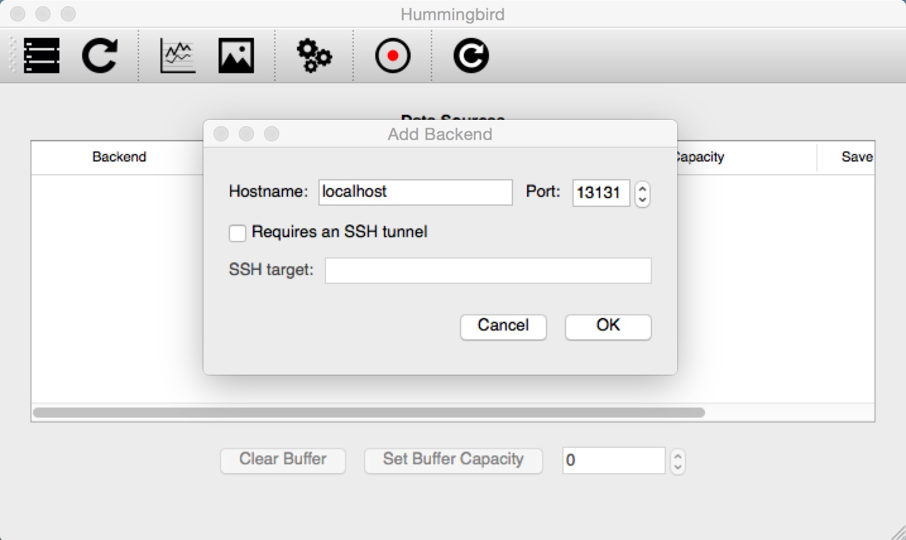
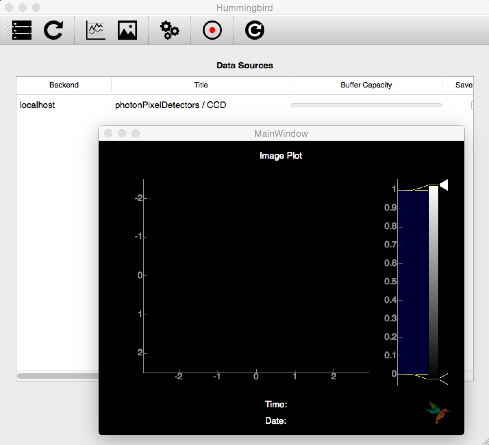
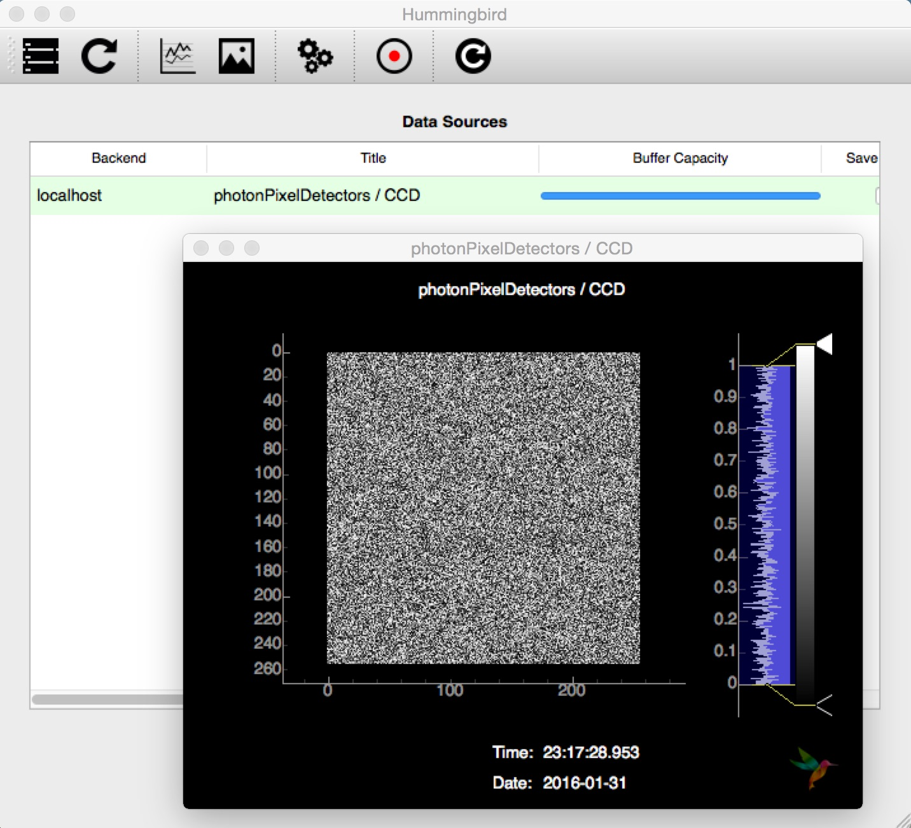
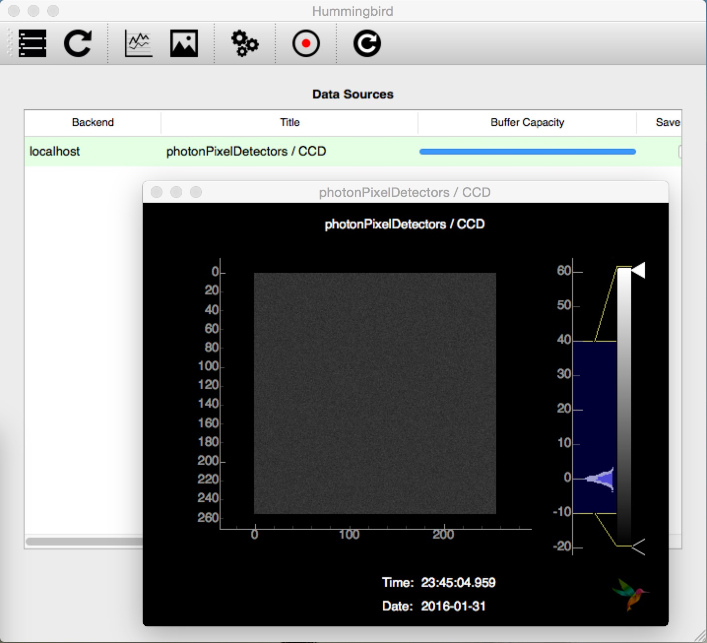
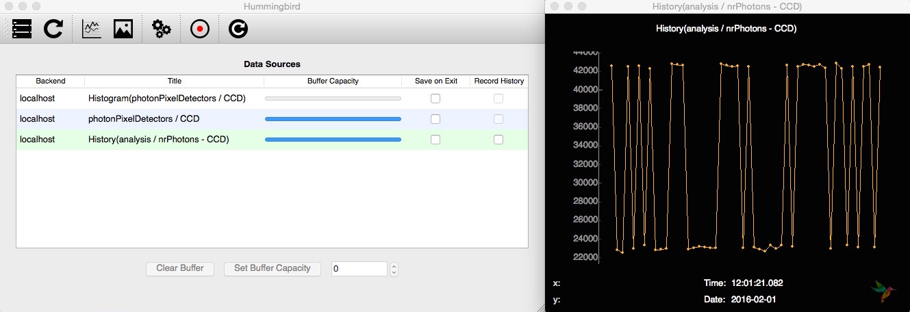
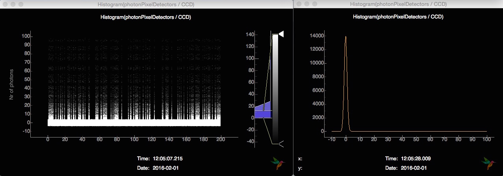
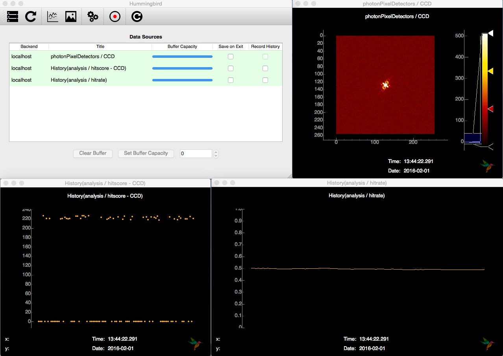

Basic examples
==============

dummy.py
--------
This is the most basic and simple example which generates randomized 256x256 images as fake detector events showing up as ``evt['photonPixelDetectors']['CCD']`` for virtual events created at a repetition rate of 10 Hz:

.. literalinclude:: ../examples/basic/dummy.py
                       :language: python

Notice that facility and data source is defined using the ``state`` variable. For every event, the current processing rate is printed and an image with the current virtual detector image is sent to the interface. Running this example in the backend (``hummingbird.py -b examples/basic/dummy.py``) we can start the frontend (``hummingbird.py -i``) in a separate shell (or even on a separate machine) and connect it to the backend by clicking on the left-most button:

Once we are connecting, the virtual CCD shows up as a data source. After opening an image window (4th button from the left), we can subscribe to the CCD (menu **Data sources**) and the image that we were sending from the backend is displayed at a refreshing rate of 1 second:

----------

simulation.py
-------------
For the next example, we replace the random detector images with CCD images that simulate diffraction from an object produced at a given hit rate (here 50%):

.. literalinclude:: ../examples/basic/simulation.py
                       :language: python

Following the same procedure as for ``dummy.py`` we can follow the hits (left) and misses (right) show up in the interface:
      
.. image:: images/examples/basic/simulation_imagewindow1.jpg
           :width: 49.5%

-------------

detector.py
-----------

In order to add more analysis of the detector we print some statistics, count the number of photons and send a history of the photon counts and per-event detector histograms along with the CCD image:

.. literalinclude:: ../examples/basic/detector.py
                       :language: python

In the interface, we can now open a new line plot (3rd button from the left) and display the history of the photon counts by subscribing to the ``History(analysis/nrPhotons - CCD)`` data source:

The depth of the history is defined by the length of the buffer, which can be resized in the main window. To the per-event histogram of the CCD we can subscribe both from an image plot (left panel) and from a line plot (right panel):
                   

While the line plot shows the current histogram of the CCD, the image plot shows the history of the most recent detector histograms. 
                   
-----------

hitfinding.py
-------------

In the next example, we add htifinding to our analysis pipeline. We use a simply lit pixel counter given thresholds for the definition of a photon (``aduThreshold=10``) and for the definition of a hit (``hitscoreThreshold=100``):

.. literalinclude:: ../examples/basic/hitfinding.py
                       :language: python

As compared to previos examples, we are plotting the CCD image only for hits. We are also sending history plots of hitscore and hitrate. The former can be very useful for finding the correct thresholds. When changing the threshold in the configuration file, there is no need to restart the backend. We can simply reload the configuration using the reload button (right-most button). Having all plots connected, the frontend looks like this:

           
-----------

correlation.py
--------------
In the last example, we show how it is possible to correlate and compare different parameters. Therefore, we first add more virtual data to our simulation: randomzied pulse energies and (x,y) injector positions. Along with plotting the history of pulse energies and plotting the correlation of pulse energy vs. hitscore as a scatter plot, we populate a map of averaged hitrates as a function the (x,y) injector position tuple:

.. literalinclude:: ../examples/basic/correlation.py
                       :language: python

In the interface, these plots look like this:
                                        
.. image:: images/examples/basic/correlation.jpg
           :width: 99%
           :align: center
