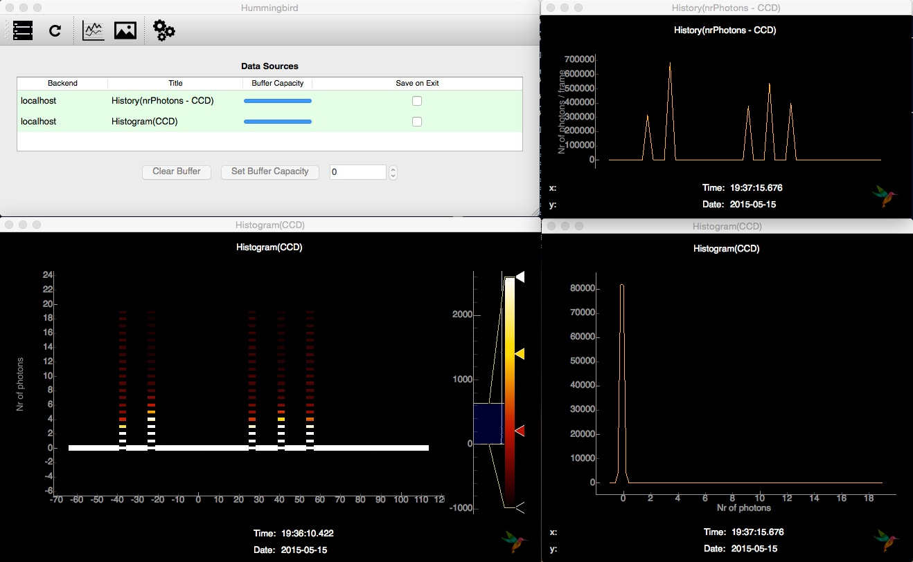

More examples
=============

Simulation
----------
For most of our examples, we are using simulated data which is provided through `Condor <http://lmb.icm.uu.se/condor/simulation>`_. If you want to know how to run these examples on real data, checkout the basic example in :doc:`Configuration <configuration>`.

We are simulating a icosahedron-shaped virus with a diameter of 60 nm under reasonable experimental conditions at the CXI beamline. The full Condor configuration file is located in ``examples/simulation/virus.conf``.

Now, lets have a look at the configuration file, located in ``examples/simulation/conf.py``. First, we are importing the ``simulation`` and the ``analysis.event`` module:

::

   import simulation.simple
   import analysis.event

We load the `Condor <http://lmb.icm.uu.se/condor/simulation>`_ configuration file and specify a hitrate of 10%:

::

   sim = simulation.simple.Simulation("examples/simulation/virus.conf")
   sim.hitrate = 0.1

In the ``state`` variable, we need to provide the simulation ``sim`` and specify the datasets we want to extract:

::

   state = {
       'Facility': 'Dummy',

       'Dummy': {
           'Repetition Rate' : 1,
           'Simulation': sim,
           'Data Sources': {
	       'CCD': {
	           'data': sim.get_pattern,
		   'unit': 'ph',
		   'type': 'photonPixelDetectors'
	       },
               'pulseEnergy': {
	           'data': sim.get_pulse_energy,
                   'unit': 'J',
                   'type': 'pulseEnergies'
	       },
               'inj_x': {
                   'data': sim.get_position_x,
                   'unit': 'm',
                   'type': 'parameters'
		               },
	       'inj_y': {
	           'data': sim.get_position_y,
                   'unit': 'm',
                   'type': 'parameters'
	       },
               'inj_z': {
                   'data': sim.get_position_z,
                    'unit': 'm',
                    'type': 'parameters'
	       }
           }        
       }
   }

Inside the ``onEvent`` function we can now run algorithms on our simulated datasets and send plots to the frontend, for now we are just printing some extracted information:

::

   def onEvent(evt):
       analysis.event.printProcessingRate()
       analysis.event.printKeys(evt)
       analysis.event.printKeys(evt, "parameters")

Lets run our small simulation example:

::

   $ ./hummingbird.py -b examples/simulation/conf.py
   Starting backend...
   1/1 (1 particle)
   The event has the following keys:  ['pulseEnergies', 'photonPixelDetectors', 'parameters']
   The event dict ''parameters'' has the following keys:  ['inj_y', 'inj_x', 'inj_z']
   1/1 (1 particle)
   Processing Rate 0.86 Hz
   The event has the following keys:  ['pulseEnergies', 'photonPixelDetectors', 'parameters']
   The event dict ''parameters'' has the following keys:  ['inj_y', 'inj_x', 'inj_z']

Detector characteristics
------------------------
In this example we are plotting some detector-specific characteristics (histograms, averages, ... ). The configuration file ``examples/detector/conf.py`` is based on the simulation example, but in addition we are importing some more modules:

::

   import simulation.simple
   import analysis.event
   import analysis.pixel_detector
   import plotting.line

In the ``onEvent`` function we add a few lines in order to look at some characteristics of the detector:

::

   # Detector statistics
   analysis.pixel_detector.printStatistics(evt["photonPixelDetectors"])

   # Count Nr. of Photons
   analysis.pixel_detector.totalNrPhotons(evt, evt["photonPixelDetectors"]["CCD"])
   plotting.line.plotHistory(evt["nrPhotons - CCD"], label='Nr of photons / frame', history=50)

   # Detector histogram
   plotting.line.plotHistogram(evt["photonPixelDetectors"]["CCD"], **histogramCCD)

On the backend side, we can now see some detector statistics

::

   $ ./hummingbird -b examples/detector/conf.py
   Processing Rate 0.65 Hz
   The event has the following keys:  ['pulseEnergies', 'photonPixelDetectors', 'parameters']
   The event dict ''parameters'' has the following keys:  ['inj_y', 'inj_x', 'inj_z']
   CCD (count): sum=-79.434 mean=-0.000463453 min=-0.412553 max=0.506501 std=0.100154
   1/1 (1 particle)
   Processing Rate 0.65 Hz
   The event has the following keys:  ['pulseEnergies', 'photonPixelDetectors', 'parameters']
   The event dict ''parameters'' has the following keys:  ['inj_y', 'inj_x', 'inj_z']
   CCD (count): sum=-46.7338 mean=-0.000272666 min=-0.456227 max=0.47392 std=0.100047
   1/1 (1 particle)

On the frontend, we can see that there a two data sources available, a history of photon counts and a histogram of the CCD:

The history of photon counts, we can only visualize as a line plot (upper right), whereas the histogram can be display a a line plot (lower left) and as an image (lower right). All these plots give us information on signal and noise on the detector.

In the configuration file, The plotting parameters for the histogram (as for any plotting function) can be given as keyword arguments or defined outside the ``onEvent`` function as a dictionary which is then passed as a whole to the plotting function:

::

   histogramCCD = {
       'hmin': -1,
       'hmax': 19,
       'bins': 100,
       'label': "Nr of photons",
       'history': 50}

   def onEvent(evt):

       ...
       plotting.line.plotHistory(..., history=50)
       plotting.line.plotHistogram(..., **histogramCCD)

   
Hitfinding
----------

Sizing
------

Correlations
------------

