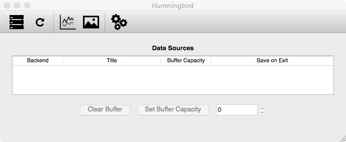
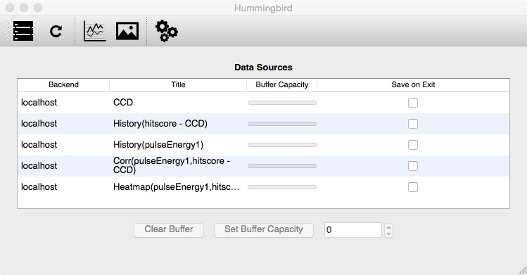

Getting Started
===============

Running Hummingbird
-------------------
You can run ``./hummingbird.py -h`` to get some information about the
available options of Hummingbird:

::

   $ ./hummingbird.py -h
   usage: hummingbird.py [-h] [-i | -b [conf.py] | -r] [-v] [-d] [-p]
                         [--no-restore]

   Hummingbird - the Online Analysis Framework.

   optional arguments:
     -h, --help            show this help message and exit
     -i, --interface       start the control and display interface
     -b [conf.py], --backend [conf.py]
                           start the backend with given configuration file
     -r, --reload          reloads the backend
     -v, --verbose         increase output verbosity
     -d, --debug           output debug messages
     -p, --profile         generate and output profiling information
     --no-restore          no restoring of Qsettings

You can run Hummingbird in either interface ( `-i` ) or backend ( `-b` ) mode.

Backend
*******

When running in backend mode the program will read and analyse data according
to the provided configuration file. When no configuration file is given, the file ``examples/basic/dummy.py``, the
default configuration file, will be used. 

Frontend
********

When running in interface mode the GUI program will be launched:

After adding a backend (upper left button) the program is waiting for connections from
backends and can display any data that the backends send to it:

