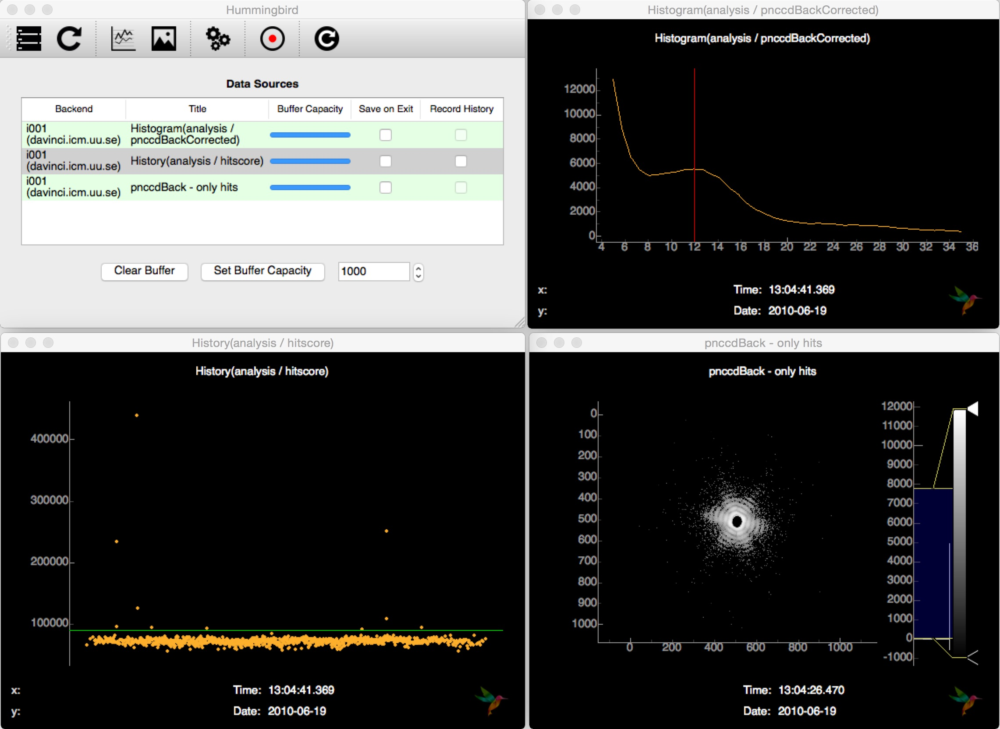

LCLS examples
=============

To be able to run from LCLS data you need to have a functioning `PSANA` environment. There
is lots of documentation about how to set up things on the |psana| page.

.. |psana| raw:: html

          <a href="https://confluence.slac.stanford.edu/display/PSDM/psana+python" target="_blank">LCLS Data Analysis</a>

.. tip::
   
   If you get strange errors running Hummingbird like syntax errors or
   ``ImportError: No module named psana`` make sure that you have run the setup
   step:

   ``. /reg/g/psdm/etc/ana_env.sh``

Hit finding of mimivirus
------------------------

This example is based on diffraction data from mimivirus (cite) published in the |cxidb| (entry 30).
In order to run this example, it is necessary to download raw data files (XTC format) for a dark run (73) and a diffraction run (92)
and put it inside a directory for XTC files.

.. |cxidb| raw:: html
                 
   <a href="http://www.cxidb.org" target="_blank">CXIDB</a>

mimi_dark.py
------------

First, we need to get the average dark image running the backend with the following configuration:

.. literalinclude:: ../examples/lcls/mimi_dark.py
                    :language: python

This will save the average dark in an HDF5 file named ``dark_run73.h5``.

mimi_hits.py
------------

With the average dark image ready, we can run with the following configuration:

.. literalinclude:: ../examples/lcls/mimi_hits.py
                    :language: python

This performs detector correction (subtraction of average dark, common-mode), does hit finding based on a simple lit pixel counter and sends off detector images of hits as well as diagnostic plots for tuning the hit finder to the frontend.

Connecting to the backend interface and subscribung to the available source, Hummingbird shows hit images and other diagnostic information (hitscore, detector histogram, ...):

